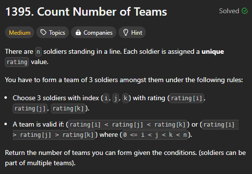
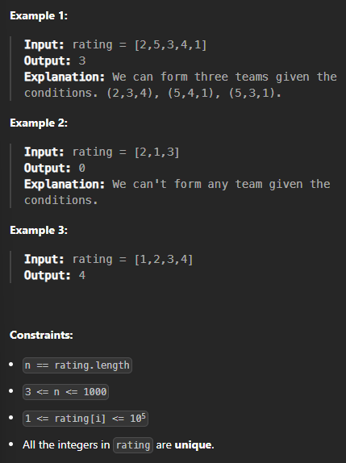

# [Count Number of Teams](https://leetcode.com/problems/count-number-of-teams/description/?envType=daily-question&envId=2024-07-29)
### Array | Dynamic Programming | Binary Indexed Tree
###### 2024-07-29

<br>
<br>

## 간략한 문제 설명



<br>

`n`명의 병사가 일렬로 서있다. 각자 `rating[i]`를 부여받았다.  
**이 중에서 세 명을 골랐을 때 `rating[i]`이 순서대로 단조 증가 or 단조 감소인 조합의 수는?**

<br>



<br>
<br>

## 인사이트
그때그때 세 명을 뽑기에는 시간이 너무 오래 걸린다. 일단 하나를 고정시켜야 한다. 그런데 어떤 것을 고정해야 할까?

셋 중에서 가장 왼쪽에 있는 병사를 고정시키면? 나머지 둘을 고르기 위해 O(n^2)가 소모된다.
가장 오른쪽 역시 마찬가지다. 그러니 전체적으로 O(n^3)가 걸린다.

그렇다면 가운데를 고정시키면 어떨까? 아래 방법을 보면 각 병사마다 O(n)이 걸리는 것을 알 수 있다. 즉, 전체적으로 O(n^2)가 걸린다. space complexity는 O(1)로 준수하다.

1. 가운데 병사를 고정시킨다.
2. 그 병사 왼쪽에 있는 사람 중 rating의 값이 높은 사람의 수와 낮은 사람의 수를 구한다.
3. 그 병사 오른쪽에 있는 사람에 대해서도 똑같이 구한다.
4. 크로스로 곱하면 된다! 

<br>
<br>

## 내 풀이
Time Complexity: O(n^2)  
Space Complexity: O(1)
```python
# chatGPT에게 refactoring만 받음

class Solution:
    def numTeams(self, rating: List[int]) -> int:
        total_teams = 0
        
        for i in range(1, len(rating) - 1):
            left_less = 0
            left_more = 0
            right_less = 0
            right_more = 0
            
            for left in range(0, i):
                if rating[left] < rating[i]:
                    left_less += 1
                else:
                    left_more += 1
            
            for right in range(i + 1, len(rating)):
                if rating[right] < rating[i]:
                    right_less += 1
                else:
                    right_more += 1
            
            total_teams += left_less * right_more
            total_teams += left_more * right_less
        
        return total_teams
```

나쁘지 않아~~


