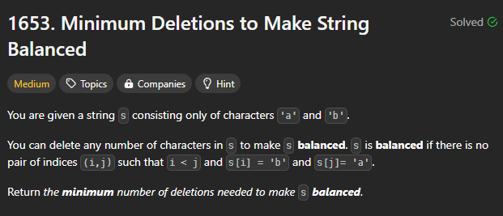

# [240730_Minimum Deletions to Make String Balanced](https://leetcode.com/problems/minimum-deletions-to-make-string-balanced/description/?envType=daily-question&envId=2024-07-30)
### Dynamic Programming
###### 2024-07-30

<br>
<br>

## 간략한 문제 설명



<br>

문자열 `s`는 `a`와 `b`로 이루어져 있다.  
최종 문자열이 왼쪽은 `a`로 가득~ 오른쪽은 `b`로 가득~  
하기 위해 **지워야 할 문자의 최소 숫자**를 구하라.

<br>


<br>
<br>

## 인사이트
문자열을 처음부터 끝까지 훑으면서 그때그때 문자열이 aaaa...bbbb가 되도록 바꾸는 식으로 local optimum을 찾아도 문제를 해결할 수 있다.  

이전 상태를 기반으로 바로 다음 상태를 결정하기 때문에 `Dynamic Programming`을 사용하면 된다.

<br>
<br>

## 내 풀이
Time Complexity: O(n)  
Space Complexity: O(n)
```python
# chatGPT에게 refactoring과 일부 영감을 받음

class Solution:
    def minimumDeletions(self, s: str) -> int:
        len_s = len(s)

        # dp[i]는 0부터 i-1까지의 문자열을 aaa....bbb 처럼 만들게 하기 위한 최솟값을 의미한다
        dp = [0] * (len_s + 1)

        #지금까지 만난 b의 숫자. 이걸 알아야지 지난 b를 싹 지울지 새로 만난 a를 b로 바꿀지 결정할 수 있다
        count_b = 0 

        for i in range(1, len_s + 1):
            if s[i - 1] == 'a':
                dp[i] = min(dp[i - 1] + 1, count_b)
            else:
                dp[i] = dp[i - 1]
                count_b += 1

        return dp[len_s]
```

기록은 딱히 좋지 않다.


<br>
<br>

## 기타 - 굳이 dp의 길이를 len_s + 1로 한 이유

왜 굳이 dp의 길이를 굳이 len_s + 1로 만들어서 계산하기 복잡하게 하나,, 싶을 수도 있는데 그렇게 하지 않을 경우 코드가 이런 식으로 변한다

```python
class Solution:
    def minimumDeletions(self, s: str) -> int:
        len_s = len(s)
        dp = [0] * len_s
        count_b = 0

        for i in range(len_s):
            if s[i] == 'a':
                dp[i] = dp[i - 1] + 1 if i > 0 else 0
                if count_b > 0:
                    dp[i] = min(dp[i], count_b)
            else:
                dp[i] = dp[i - 1] if i > 0 else 0
                count_b += 1

        return dp[len_s - 1]
```

아래처럼 i가 0인지 아닌지를 계속 봐줘야 한다.  

```python
dp[i] = dp[i - 1] + 1 if i > 0 else 0
```

왜냐면 처음으로 접근을 할 때는, 그러니까 문자열 길이가 1인 상태의 초기 접근에서는, 그러니까 i가 0인 상태에서는,  
이전 리스트의 값을 참고하는 게 아니라(인덱스 0보다 왼쪽은 없다) 임의로 0이라는 값과 비교해줘야 하기 때문에 아무 이유 없이 계속해서 `if 조건`을 확인해야 하는 낭비가 발생한다.  

이것만 해도 O(n)은 후딱 먹는다.

<br>
<br>

## 기타 - 근데 이거 굳이 dp로 안 해도 된다
- dp로 저장하는 값이 2차원 행렬이 아니라 1차원 단순 리스트인데다가
- dp로 참조하는 값이 직전 값에만 해당되기 때문에 굳이 dp로 주루룩 나열할 필요가 없다.

이는 피보나치 계산을 할 때 굳이 `fibo[1]`부터 `fibo[n-1]`까지 담아둘 필요가 없고 그냥 `fibo[n-2]`와 `fibo[n-1]`만 담아두면 되는 것과 같다.  

그럼 아주 간단하게 다음 코드와 같게 변한다.

```python
class Solution:
    def minimumDeletions(self, s: str) -> int:
        len_s = len(s)
        previous = 0
        count_b = 0

        for i in range(len_s):
            if s[i] == 'a':
                previous = min(previous + 1, count_b)
            else:
                count_b += 1

        return previous
```

여기서 Time Complexity는 O(n)이 되고, Space Complexity는 O(1)으로 확 줄어버린다. 아마 이것 때문에 내 원래 코드의 Space Complexity가 나쁘게 나온 것 같다.