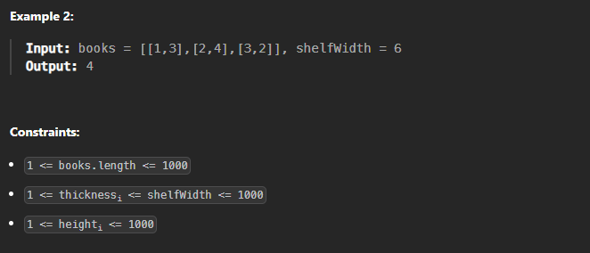
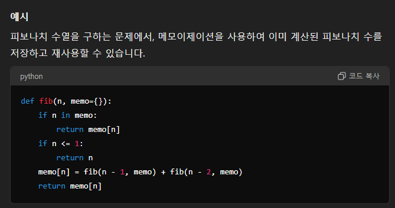
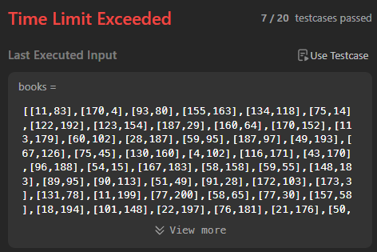

# [240731_Filling Bookcase Shelves](https://leetcode.com/problems/filling-bookcase-shelves/description/?envType=daily-question&envId=2024-07-31)
### Dynamic Programming
##### 2024-07-31

<br>
<br>

# 🤔 문제


<br>
<br>

문제가 긴데 알아서 잘~ 해석해 보세요 ㅎㅎ

<br>
<br>




<br>
<br>

# ✨ 인사이트
보자마자 당연히 `Dynamic Programming`을 써야 할 것 같았다. 맞긴 한데 그냥 감일 뿐이었고,, 어떤 경우에 DP를 써야 하는지 이번 기회에 알아보기로 했다.  

<br>

### 🍯 꿀팁 - 어떤 경우에 DP를 써야 하는가? 

##### 1. 최적 부분 구조 (Optimal Substructure)
문제를 작은 부분 문제로 나눌 수 있고, 이 부분 문제들의 optimum을 통해 전체 문제의 optimum을 구할 수 있을 때  
**ex. 최단 경로 문제**

##### 2. 중복되는 부분 문제 (Overlapping Subproblems)
부분 문제가 여러 번 재사용될 때  
**ex. 피보나치 수열**

##### 3. 상태와 상태 전이 (State and State Transition)
현재 상태와 이전 상태 간의 관계를 정의할 수 있을 때

<br>

### 🍯 꿀팁 - DP의 대표적 방법

### 메모이제이션 (Memoization)

- Top-Down (최상위에서 시작하여 점차적으로 하위 문제 해결)
- 주로 재귀 함수 사용
- **장점**: 필요한 부분만 계산해서 효율적
- **단점**: 재귀 호출로 stack overflow의 위험

### 테이블 방식 (Tabulation)

- Bottom-Up (작은 문제부터 시작해서 점차적으로 큰 문제 해결)
- 주로 반복문 사용
- **장점**: 순서대로 해결하므로 stack overflow 위험이 없음
- **단점**: 모든 부분 문제를 계산하기 때문에 비효율적

<br>
<br>

# 🫠 망한 내 풀이 (사유: TLE)
Time Complexity: O(2^n)  
Space Complexity: O(n)  

```python
# 100% 혼자

class Solution:
    def minHeightShelves(self, books: List[List[int]], shelf_width: int) -> int:
        dp_list = [float("inf") for _ in range(len(books)+1)]
        dp_list[0] = 0

        def dp(book_num: int, remain_width: int, prev_shelf_book_num: int, this_shelf_height: int) -> int:
            if book_num == len(books)+1: return

            book_width, book_height = books[book_num-1][0], books[book_num-1][1]

            dp_list[book_num] = min(dp_list[book_num], dp_list[book_num-1]+book_height)
            dp(book_num+1, shelf_width-book_width, book_num-1, book_height)

            if remain_width != shelf_width and book_width <= remain_width:
                dp_list[book_num] = min(dp_list[book_num], dp_list[prev_shelf_book_num]+max(this_shelf_height, book_height))
                dp(book_num+1, remain_width-book_width, prev_shelf_book_num, max(this_shelf_height, book_height))

        dp(1, shelf_width, 0, books[0][1])
        return dp_list[len(books)]
```  

dp 안에 dp를 두 개나 넣어버린 기가 막힌 능지처참으로 매번 2개의 선택지가 새로 생겼고 exponential이라는 전무후무한 time complexity가 나와서 방금 벌로 1시간 동안 에어컨 껐음.  



<br>
<br>

# ✅ 정답
Time Complexity: O(n^2)  
Space Complexity: O(n)  

```python
class Solution:
    def minHeightShelves(self, books: List[List[int]], shelf_width: int) -> int:
        n = len(books)
        # dp[i]는 i번째 책까지 놓았을 때 최소 높이
        dp = [float("inf")] * (n + 1)
        dp[0] = 0

        for i in range(1, n + 1):
            width = 0 # 현재 선반 총 너비
            height = 0 # 현재 선반 최대 높이
            for j in range(i, 0, -1):
                width += books[j - 1][0]
                if width > shelf_width:
                    break
                height = max(height, books[j - 1][1])
                dp[i] = min(dp[i], dp[j - 1] + height)

        return dp[n]
```

첫 번째 루프에서 i번째 책을 '마지막으로' 배치하는 경우를 고려한다.  

두 번째 루프에서는 i번째부터 i-1, i-2, i-3... 이런 식으로 뒤로 거슬러 가며 책의 두께를 모두 더해 `width`에 저장한다. (이 값이 `shelf_width`보다 크지 않을 때까지만)

i부터 j(<=i)까지 한 선반 위에 놓을 수 있다고 하면 일단 현재 선반의 최대 높이 `height`를 다시 정해주고, `dp[i]`의 값도 다시 정해준다.  

`height` 계산은 직관적이니까 넘어가고,  
`dp[i]`의 경우를 보면, `dp[j-1]`는 j보다 더 전, 그러니까 이전 선반까지의 높이를 모두 더한 다음에 현재 선반의 높이 `height`를 정하는 식으로 계산한다.  

루프가 O(n^2)만큼 돌며 그 안에 있는 dp[i]나 dp[j-1]의 경우도 이미 있는 값이기 때문에 추가적으로 드는 시간은 없다.  

따라서 Time Complexity: O(n^2), Space Complexity: O(n)로 가볍게 결정된다.