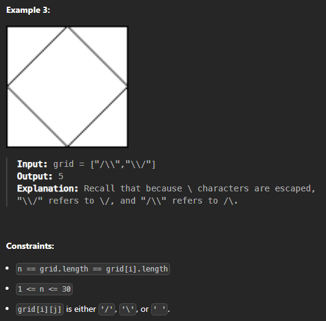

# [240810_Regions Cut By Slashes](https://leetcode.com/problems/regions-cut-by-slashes/description/?envType=daily-question&envId=2024-08-10)
### BFS, DFS
##### 2024-08-10

<br>
<br>

# 🤔 문제


<br>
<br>

이건 진짜 모르겠다. 왜 Medium일까?

<br>
<br>

  


<br>
<br>

# ✨ 인사이트 - Expanded Grid
slash가 있는 칸을 binary하게 처리하기 위해 각 칸을 3X3으로 늘려보자. 그러면 2X2의 그림은 아래 그림처럼 6X6으로 늘어난다.  

  

이렇게 되면 `초록색 0`으로 쓰인 곳을 연결하여 하나의 땅으로 볼 수 있고, 이를 위해서 `flood-fill algorithm`을 사용하면 전체 땅의 개수(구하고자 하는 regions의 개수)를 구할 수 있다.  
(flood-fill algorithm을 사용하면 slash로 갈라지지 않은 영역 내의 영역을 모두 찾게 된다.)

<br>
<br>

# ✅ 정답 - Expanded Grid
Time Complexity: O(n^2)  
Space Complexity: O(n^2)

```python
class Solution:

    # Directions for traversal: right, left, down, up
    DIRECTIONS = [
        (0, 1),
        (0, -1),
        (1, 0),
        (-1, 0),
    ]

    # 이것이 regions의 수를 찾는 메인 함수
    def regionsBySlashes(self, grid):
        grid_size = len(grid)
        # Create a 3x3 matrix for each cell in the original grid
        expanded_grid = [[0] * (grid_size * 3) for _ in range(grid_size * 3)]

        # Populate the expanded grid based on the original grid
        # 1 represents a barrier in the expanded grid
        for i in range(grid_size):
            for j in range(grid_size):
                base_row = i * 3
                base_col = j * 3
                # Check the character in the original grid
                if grid[i][j] == "\\":
                    # Mark diagonal for backslash
                    expanded_grid[base_row][base_col] = 1
                    expanded_grid[base_row + 1][base_col + 1] = 1
                    expanded_grid[base_row + 2][base_col + 2] = 1
                elif grid[i][j] == "/":
                    # Mark diagonal for forward slash
                    expanded_grid[base_row][base_col + 2] = 1
                    expanded_grid[base_row + 1][base_col + 1] = 1
                    expanded_grid[base_row + 2][base_col] = 1

        region_count = 0
        # Count regions using flood fill
        for i in range(grid_size * 3):
            for j in range(grid_size * 3):
                # If we find an unvisited cell (0), it's a new region
                if expanded_grid[i][j] == 0:
                    # Fill that region
                    self._flood_fill(expanded_grid, i, j)
                    region_count += 1

        return region_count

    # Flood fill algorithm to mark all cells in a region
    # BFS로 했는데 DFS로 해도 상관없다.
    def _flood_fill(self, expanded_grid, row, col):
        queue = [(row, col)]
        expanded_grid[row][col] = 1

        while queue:
            current_cell = queue.pop(0)
            # Check all four directions from the current cell
            for direction in self.DIRECTIONS:
                new_row = direction[0] + current_cell[0]
                new_col = direction[1] + current_cell[1]
                # If the new cell is valid and unvisited, mark it and add to queue
                if self._is_valid_cell(expanded_grid, new_row, new_col):
                    expanded_grid[new_row][new_col] = 1
                    queue.append((new_row, new_col))

    # Check if a cell is within bounds and unvisited
    def _is_valid_cell(self, expanded_grid, row, col):
        n = len(expanded_grid)
        return (
            row >= 0
            and col >= 0
            and row < n
            and col < n
            and expanded_grid[row][col] == 0
        )
```

생각보다 별 거 없고 난이도도 쉬운 코드다.  
`regionBySlashes()`를 통해 expanded_grid에서 현재 위치한 땅을 포함하는 땅을 전부 훑은 다음에 region_count에 1을 더한다.  
이때 `_flood_fill()`함수를 사용(앞에 underbar(_)가 붙은 이유는 내부적으로 사용하길 권장하기 때문)하는데 이는 최초의 (row, col)을 parameter로 받아서 이미 방문한 곳의 값은 1로 처리하고 아직 가지 않은 값을 BFS로 쭉 처리한다.