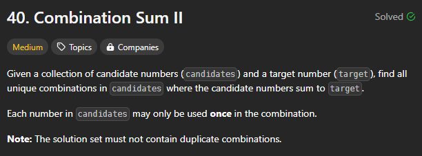
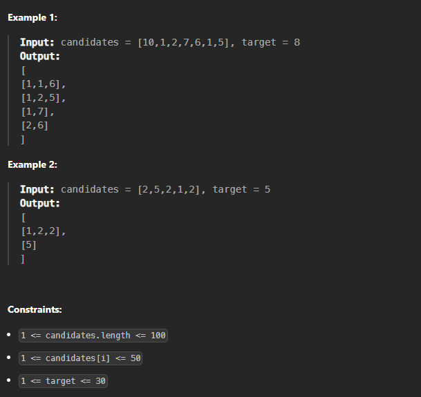
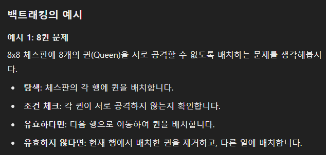
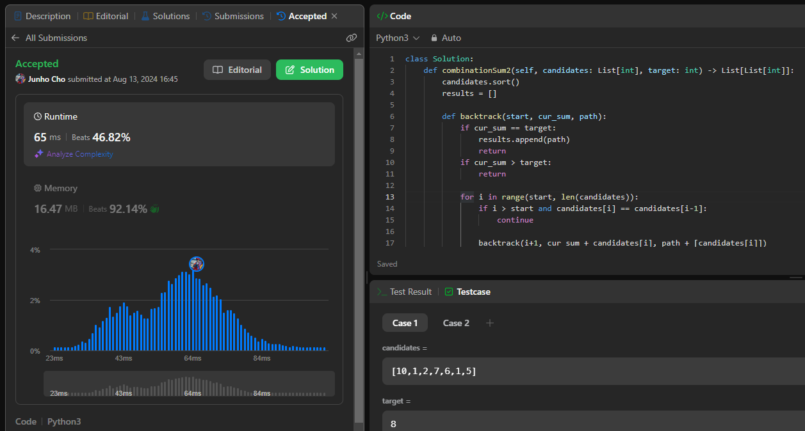

# [240813_Combination Sum II](https://leetcode.com/problems/combination-sum-ii/description/?envType=daily-question&envId=2024-08-13)
### Backtracking
##### 2024-08-13

<br>
<br>

# 🤔 문제



<br>
<br>

주어진 `리스트`에서 요소들을 골라서 그 합이 `타겟`이 되도록 하는 아주 뻔한 문제다.

<br>
<br>



<br>
<br>

# ✨ 인사이트
모든 요소들을 넣을지, 넣을지 말지를 결정해야 하기 때문에 time complexity는 O(2^n)이 나온다. 이론적으로 이보다 빠를 수는 없다.  
그렇다면 이를 가능하게 하기 위해서는 `Backtracking`을 사용해야 한다.

<br>

### 🍯 꿀팁 - `Backtracking`이란?
가능한 모든 방법을 시도하는 탐색 과정 중, 해결 방법이 아닌 것으로 드러나면 되돌아가서(backtrack) 다른 경로를 탐색하는 방식이기 때문에 `backtracking`이라는 이름이 붙었다.  

combination, permutation, subset 문제를 풀 때 사용할 수 있으며, 예시로는 아래와 같이 Queen Problem이 있다.  



<br>

### `Backtracking` 간단한 예시

주어진 list에서 생성 가능한 모든 subset을 뽑는 예시는 다음과 같다.  

```python
def backtrack(current, nums, index):
    # 현재까지의 경로 또는 선택된 요소들 출력 (또는 처리)
    print(current)

    # 가능한 모든 다음 단계를 시도
    for i in range(index, len(nums)):
        # 다음 요소를 선택 (경로에 추가)
        current.append(nums[i])
        
        # 재귀적으로 다음 단계로 진행
        backtrack(current, nums, i + 1)
        
        # 선택한 요소를 취소 (백트랙)
        current.pop()

# 주어진 숫자 배열
nums = [1, 2, 3]
backtrack([], nums, 0)
```

parameter에 포함된 `current`는 현재 선택된 요소들의 경로, `nums`는 전체 list, `index`는 다음에 고려할 index를 뜻한다.  
`for i in range(index, len(nums))`를 통해 선택 가능한 요소들을 모두 선택한 뒤, 계속해서 재귀적으로 다음 단계로 진행한다. 여기서 주의할 점은 다시 `backtrack`을 호출할 때 index로는 i+1를 넣어줘야 한다는 것이다.

<br>
<br>

# ✅ 정답
Time Complexity: O(2^n)  
Space Complexity: O(n)  

```python
class Solution:
    def combinationSum2(self, candidates: List[int], target: int) -> List[List[int]]:
        # 중복된 조합은 빼야 하기 때문에 일처리를 쉽게 하기 위해 sorting을 한다. 어차피 time complexity가 O(2^n)인 마당에 이 정도는 가볍다.
        candidates.sort()
        results = []
        
        def backtrack(start, cur_sum, path):
            if cur_sum == target:
                results.append(path)
                return
            if cur_sum > target:
                return
            
            for i in range(start, len(candidates)):
                # 앞으로 더 훑어야 할 숫자들 중에서 맨 첫 번째로 등장하는 애만 골라야 중복 문제를 해결할 수 있다.
                if i > start and candidates[i] == candidates[i-1]:
                    continue
                
                backtrack(i+1, cur_sum + candidates[i], path + [candidates[i]])

        backtrack(0, 0, [])
        return results
```

