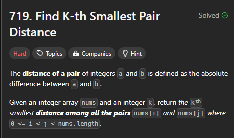
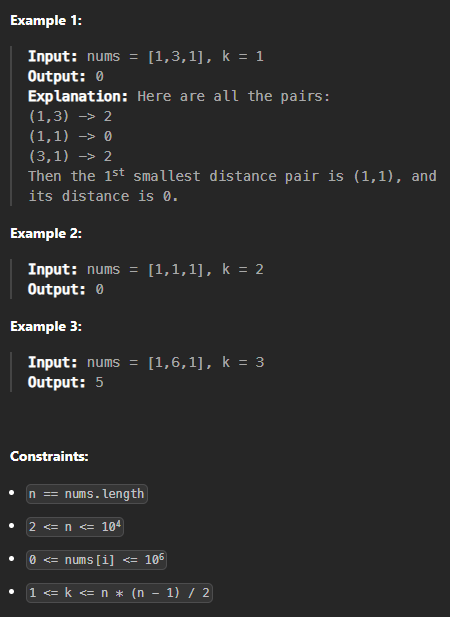

# [240814_Find K-th Smallest Pair Distance](https://leetcode.com/problems/find-k-th-smallest-pair-distance/description/?envType=daily-question&envId=2024-08-14)
### Binary Search, Two Pointers

<br>
<br>

# 🤔 문제




<br>
<br>

# ✨ 인사이트
가능한 모든 쌍을 찾으면 아주 쉽겠지만 그건 `O(n^2)`가 걸린다. 이게 왜 Hard 난이도인지 생각해야 한다. `O(nlogn)`만에 끝낼 수는 없을까?  

list에서 두 요소를 뽑았을 때 그 차이가 임의의 수 `m`보다 작은 경우를 모두 구하려면 얼마나 걸릴까? `O(n)`이 걸린다. `Two Pointers`를 사용하면 된다.  

그렇다면 우리가 해야 할 일은 `m`의 값을 list에서 뽑은 두 요소의 최솟값과 최댓값 사이를 `Binary Search`를 통해 조절하며 k에 가깝게 다가가는 것이다. 이 경우 `O(logn)`이 걸리기 때문에 곱하면 총 `O(nlogn)`이 나온다.

<br>
<br>

# 👟 알고리즘 설명
1. `nums`를 정렬해서 이후 사용할 `Two Pointers`의 기반을 다진다.
2. 주어진 숫자 `distance`보다 작은 차이를 가지는 list 내의 두 요소 쌍의 개수를 구하는 함수 `countLessOrEqual(distance: int)`를 정의한다.  
3. `Binary Search`를 사용할 시작점 `low`를 0으로 두고, `high`는 가장 큰 차이로 둔다. *(list내 모든 숫자가 달라서 차이값이 0인 쌍이 없을 수도 있지만 이건 그냥 가능한 range를 최대한 넉넉하게 잡아둔 것이기 때문에 상관없다.)*
4. `Binary Search`가 끝나고 남은 `high`가 정답!💡
   
<br>
<br>

# ✅ 정답
Time Complexity: `O(nlogn)`
Space Complexity: `O(1)`  

```python
class Solution:
    def smallestDistancePair(self, nums: List[int], k: int) -> int:
        nums.sort()
        length = len(nums)

        def countLessOrEqual(distance: int):
            cnt = 0
            ptr1 = 0

            for ptr2 in range(1, length):
                while nums[ptr2] - nums[ptr1] > distance: ptr1 += 1
                cnt += ptr2 - ptr1            
            return cnt
        
        low = 0
        high = nums[-1] - nums[0]

        while low < high:
            mid = (low + high) // 2
            if countLessOrEqual(mid) < k: low = mid + 1
            else: high = mid
            
        return high
```

