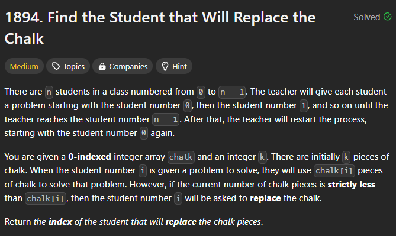
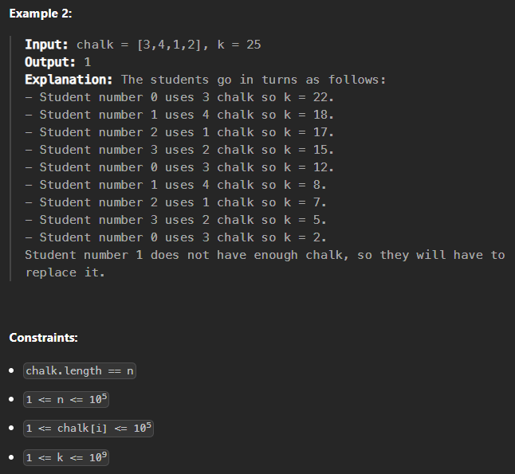
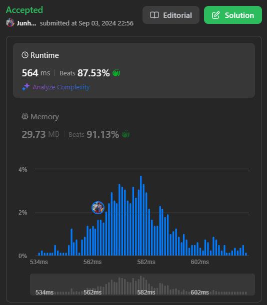

# [240902_Find the Student that Will Replace the Chalk](https://leetcode.com/problems/find-the-student-that-will-replace-the-chalk/description/?envType=daily-question&envId=2024-09-02)
### Array

<br>
<br>

# 🤔 문제




<br>
<br>

# ✨ 인사이트
처음에는 `Binary Search`를 생각했으나,, 그렇게 찾은 인덱스를 상대로 `sum[:mid+1]`를 구해야 하기 때문에 결과적으로는 `O(nlogn)`이 걸린다는 것을 깨달았다!  

그냥 우직하게 `Linear Search`하면 된다..

<br>
<br>

# 👟 알고리즘 설명
1. `k`는 `sum(chalk)`로 나눈다.
2. 이후 그냥 한 땀 한 땀 빼다가 분필이 부족해지는 시점이 오면 return...💡
   
<br>
<br>

# ✅ 정답
Time Complexity: `O(n)`  
Space Complexity: `O(1)`  

```python
class Solution:
    def chalkReplacer(self, chalk: List[int], k: int) -> int:
        k = k % sum(chalk)

        for i, amount in enumerate(chalk):
            if k < amount: return i
            k -= amount
```  

