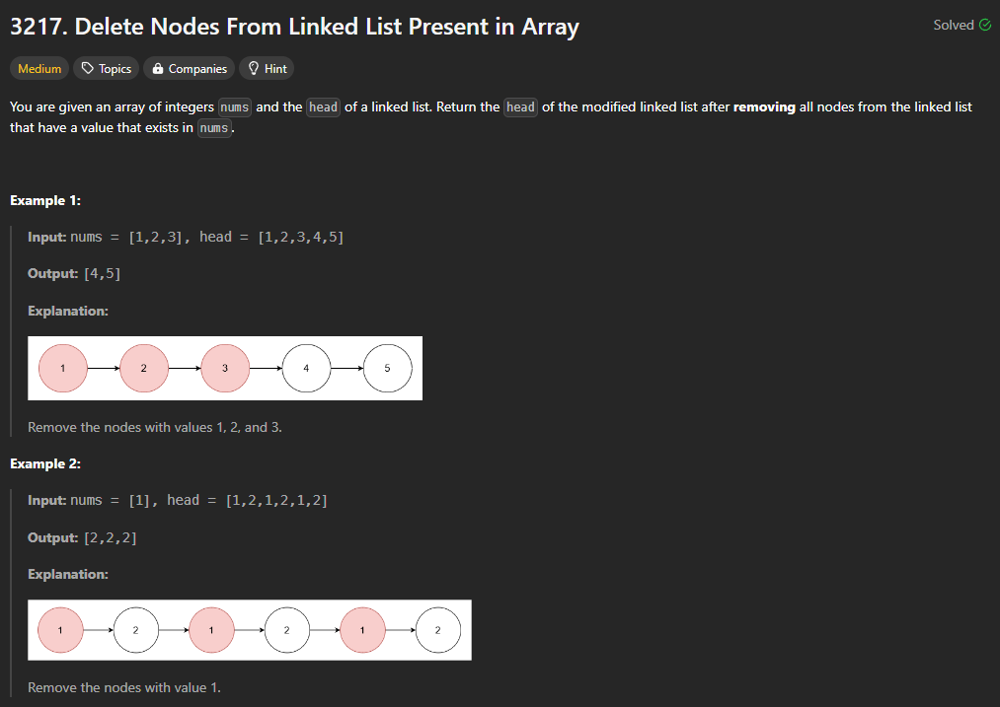
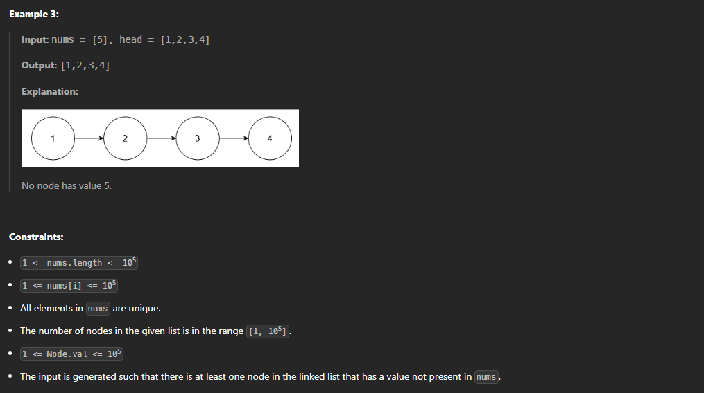
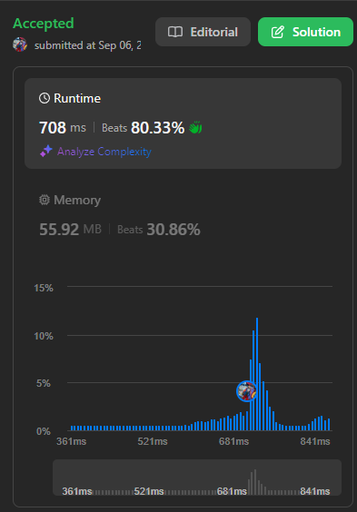

# [240906_Delete Nodes From Linked List Present in Array](https://leetcode.com/problems/delete-nodes-from-linked-list-present-in-array/description/?envType=daily-question&envId=2024-09-06)
### Hash Table, Linked List

<br>
<br>

# 🤔 문제




<br>
<br>

# ✨ 인사이트
해당 node의 `val`이 `nums`에 포함되어 있는지 확인할 때, list 변형 안 하고 그대로 하면 O(n)이나 걸리니까 조심,,,  
set으로 바꾸면 빠르게 해결된다.

<br>
<br>

# 👟 알고리즘 설명
1. `head`를 `cur`로 설정, `nums`를 list에서 set으로 바꿔 이 여정을 시작할 준비를 한다.
2. while문에서 `cur`과 `cur.next`가 있는지 판단하는 것은 아주 기본이다. (사실 최초의 유의미한 head만 잡을 수 있다면 이후에는 `cur`이 None인지 아닌지 판단하지 않아도 되지만 그건,, 시간은 줄어들겠지만 어차피 O(n)인데 그렇게 가독성까지 해쳐가며 해야하는지는 의문이다,, 뭔가 대회에 나왔다면 시도해 볼만한 듯)
3. `cur.next`의 `val`이 `nums_sets`에 포함되어 있으면 건너뛰고, 아니면 계속 이어간다.
4. 마지막으로 처리되지 않은 마지막 node가 있는지 확인하고, head의 경우도 적합성을 판단하여 최종 답안을 완성한다.
   
<br>
<br>

# ✅ 정답
Time Complexity: `O(n)`  
Space Complexity: `O(1)`  

```python
class Solution:
    def modifiedList(self, nums: List[int], head: Optional[ListNode]) -> Optional[ListNode]:
        cur = head
        nums_set = set(nums)
        
        while cur and cur.next:
            if cur.next.val in nums_set:
                cur.next = cur.next.next
            else:
                cur = cur.next

        if cur.next and cur.next.val in nums_set:
            cur.next = None
        if head.val in nums_set:
            head = head.next
        return head
```  

