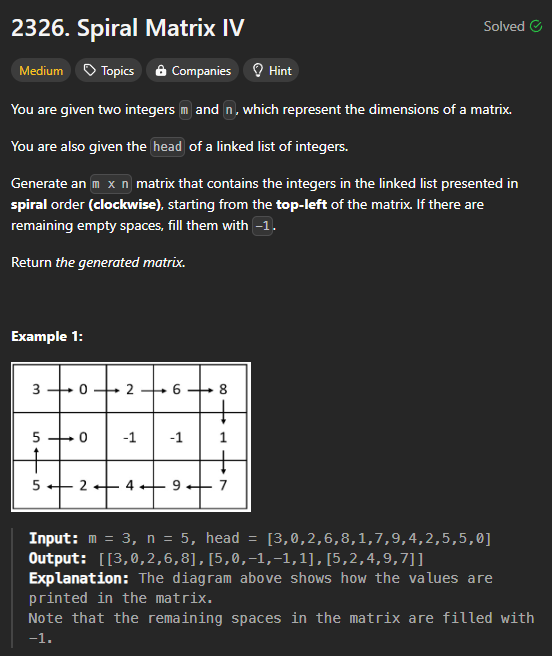
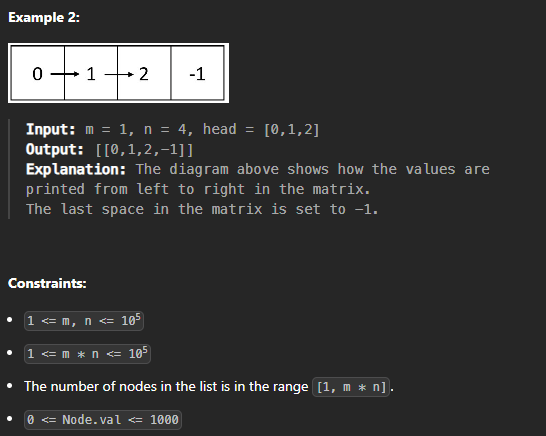
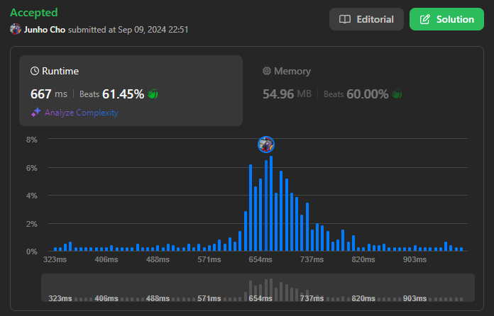

# [240909_Spiral Matrix IV](https://leetcode.com/problems/spiral-matrix-iv/description/?envType=daily-question&envId=2024-09-09)
### Matrix

<br>
<br>

# 🤔 문제




<br>
<br>

# ✨ 인사이트
방향 전환이 나오면 자고로 `directions = [(0, 1), (1, 0), (0, -1), (-1, 0)]` 그냥 써두고 시작하면 된다. 괜히 최적화 해보겠다고 시계방향으로 도는 싸이클 따로따로 만들었는데 그냥 가독성만 망가지고 오류만 늘어난다.

<br>
<br>

# 👟 알고리즘 설명
1. `directions`, `ans`을 만들고, (0, 0)에서부터 오른쪽 방향으로 갈 준비를 한다.
2. `curr`의 값이 있는지 확인하고 현재 `row`와 `col`의 값을 `ans` 행렬에 넣어준다.
3. 이후 `new_row`와 `new_col`을 만드는데 이 값이 범위를 벗어나거나 이미 지나간 곳(`ans` 값이 -1이 아닌 곳)에 다다르면 `direction`을 고쳐먹고 새롭게 `new_row`와 `new_col`을 만든다.
4. curr가 None이 되면 끝! `ans`를 return한다.
   
<br>
<br>

# ✅ 정답
Time Complexity: `O(m * n)`  
Space Complexity: `O(m * n)`  

```python
class Solution:
    def spiralMatrix(self, m: int, n: int, head: Optional[ListNode]) -> List[List[int]]:
        directions = [(0, 1), (1, 0), (0, -1), (-1, 0)]
        ans = [[-1] * n for _ in range(m)]
        row, col, direction = 0, 0, 0
        
        curr = head
        while curr:
            ans[row][col] = curr.val
            curr = curr.next
            
            new_row = row + directions[direction][0]
            new_col = col + directions[direction][1]

            if not (0 <= new_row < m and 0 <= new_col < n and ans[new_row][new_col] == -1):
                direction = (direction + 1) % 4
                new_row = row + directions[direction][0]
                new_col = col + directions[direction][1]
                
            row, col = new_row, new_col

        return ans
```  

